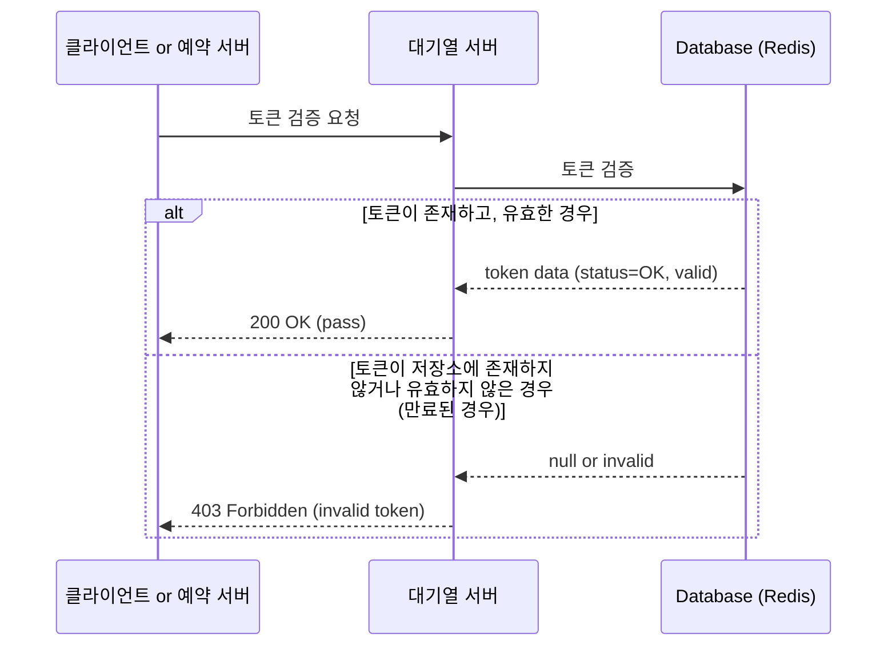
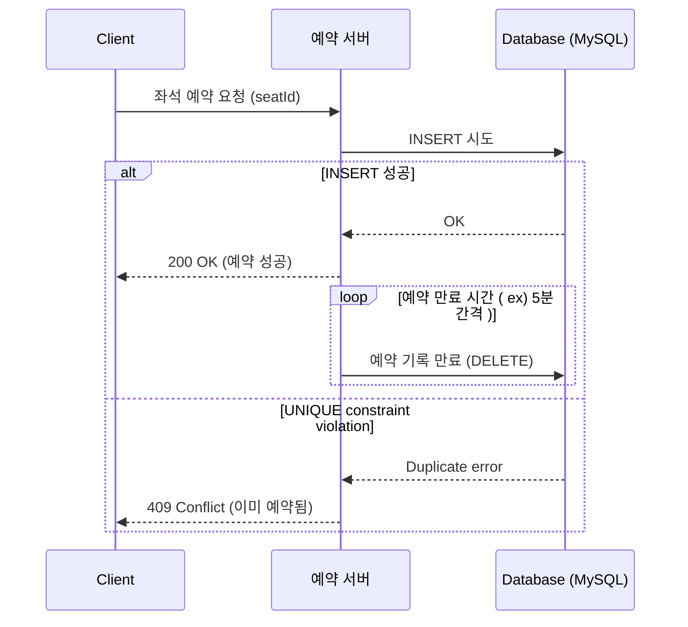
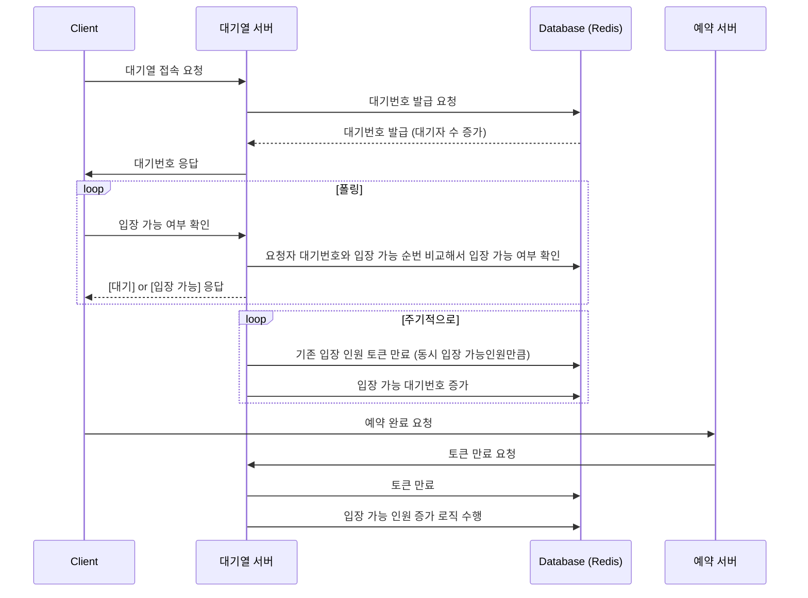
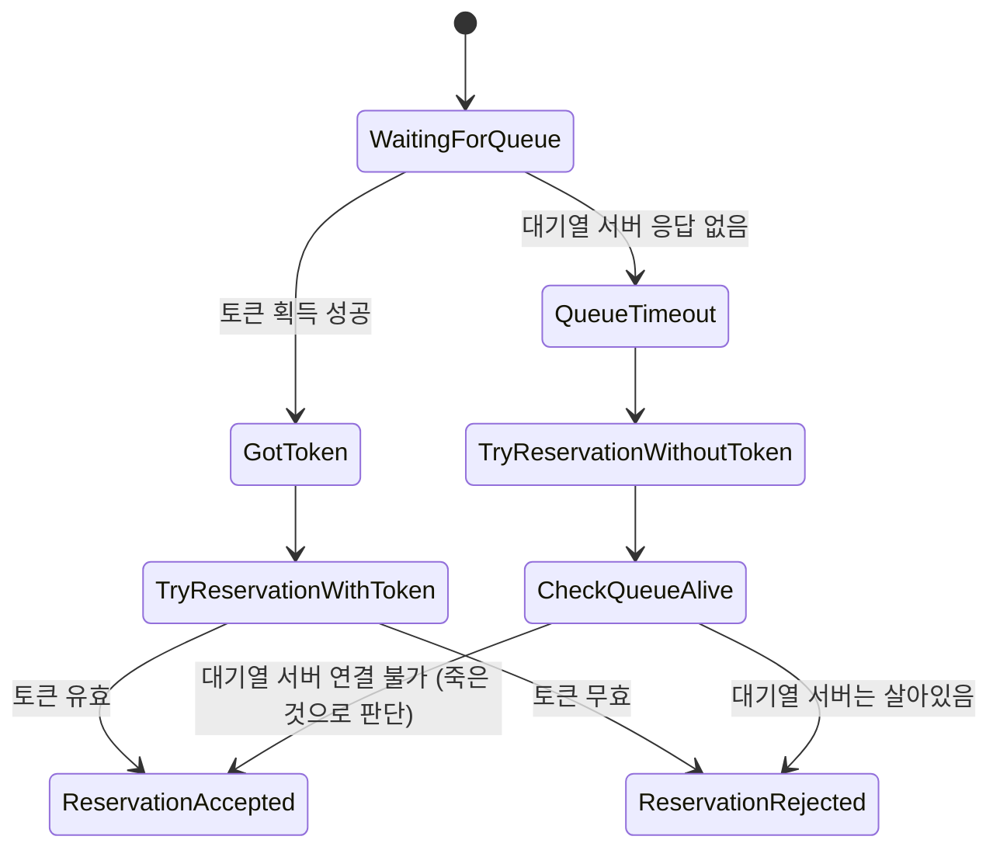
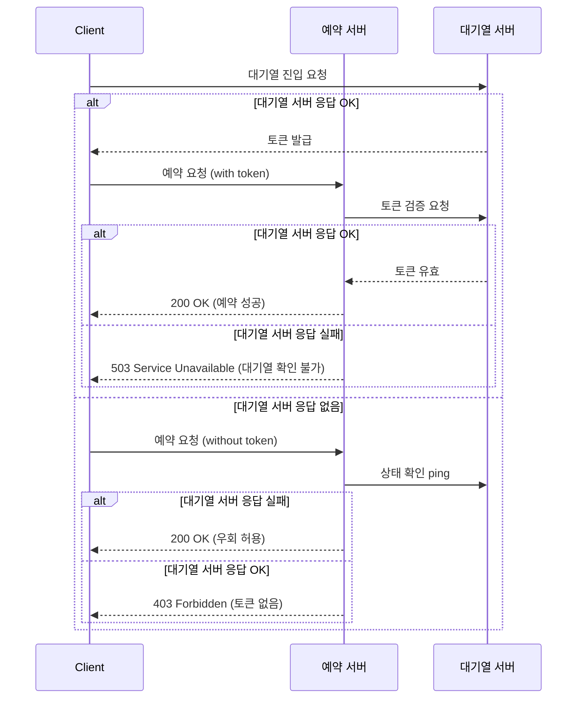
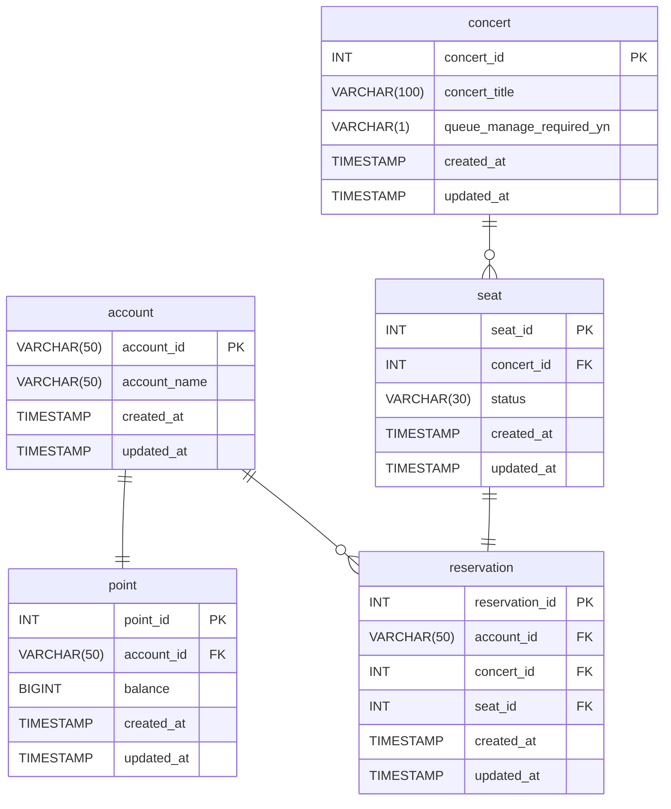

## 프로젝트

## Getting Started

### Prerequisites

#### Running Docker Containers

`local` profile 로 실행하기 위하여 인프라가 설정되어 있는 Docker 컨테이너를 실행해주셔야 합니다.

```bash
docker-compose up -d
```

## 토큰 유효성 확인 절차 (매 요청마다 아래 프로세스를 거침)



## 좌석 예약 api



추후 레디스로 개선 가능 (스케줄러 대신 레디스 만료시간을 이용)

## 대기열 기능



## 동시성 제어가 필요한 기능 목록

### 중복 요청 방지

1. 대기열 요청
2. 결제 요청

### 순서 보장

1. 대기열 요청
2. 좌석 예약

## 대기열 서버와 예약 서버의 분리에 따른 고려사항 : 대기열 서버가 다운되었을 때의 시나리오

### 서버 분리의 이유

대기열이란 개념 자체가 예약 서버에서 한번에 감당하기 힘든 큰 트래픽이 몰리는것을 방지하기 위해 존재하는것이라고 생각됩니다.
따라서 둘을 같은 서버에서 운용하는것은 목적 달성에 어긋나는 방법이라고 생각했습니다.
또한 일반적인 티켓팅 서비스에서, 대기열을 필요로하는 공연과 그렇지 않은 공연이 있을텐데 대기열 기능을 합치게 되면 대기열을 필요로하지 않는 기능에도 영향을 미치게되어 분리하는게 올바르다 생각했습니다.

처음부터 분리하는건 오버엔지니어링이지 않을까? 최초 설계에서는 하나의 서버에서 이를 담당하게 했다가 부하테스트를 진행하면서 병목지점이 생기면 분리하면 되지 않을까? 하는 생각도 했지만
이 상황이 실무라고 가정했을 때 최초부터 분리하는 설계가 좀 더 자연스러운 방향이지 않았을까 생각했습니다.
서비스가 발전함에 따라 기존 예약기능에 장애가 많이 발생했고, 해결책으로 대기열이라는 요구사항이 생겨났을것이라 예상됩니다.
대기열이란 기능과 예약기능 중 최초부터 존재하던 기능은 예약기능이고, 늘어나는 트래픽을 감당하기 위해 대기열이란 기능을 추가로 개발해야하는 것이 일반적인 시나리오라고 생각되었습니다.
그렇다면 실무에서도 처음부터 예약기능과 자연스럽게 분리하는 방향으로 설계를 하지 않았을까 생각해서 최초 설계부터 둘을 분리헤서 설게하게 되었습니다.







토큰 정보를 MySQL에 영구 저장한다는 것이 어색하게 느껴져서 (Redis에만 저장) 토큰 테이블은 제외

## 추후 고민하고 싶은 것

- 스케일 아웃에 유연한 구조인지 검토
- 표가 매진되었을 때에, 모두를 대기열에서 내쫓는게 좋을지
- 대기중이던 고객이 이탈했을 때에 "실제 입장시키려던 인원 > 실제 입장한 인원"인 상황일 때 효율적으로 핸들링하는 프로세스
- 모든 대기열 참가자의 상태를 저장하는것과 가장 오래된 참가자의 상태만 기다리는것의 비교 [참고 영상](https://youtu.be/3pO9GJ4zndE?si=jRx6JmN5KeUx7LJD)
- 고객간 잔여 유효시간이 서로 다른것에 대한 핸들링 전략 (스케줄링에 의해 입장한 참가자 vs 유효시간보다 빨리 예약을 끝낸 앞 참가자로 인해 입장한 참가자)
- 큐 도입의 타당성 검토 (현재는 순번 비교로만 설계)